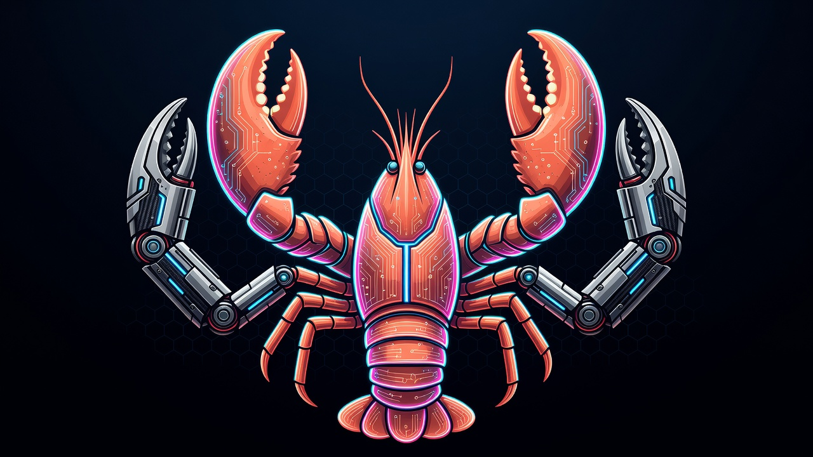

<div align="center">



# 🦞 multi-clawd

**One Claude is never enough.**

Pool every Claude Max account you own into a single failover chain —
same model, next account, full harness on every hop.

[](https://docs.openclaw.ai/plugins)
[](package.json)
[](LICENSE)
[](tsconfig.json)

*A normal lobster has two claws. This one has four.*

</div>

---

## Why

OpenClaw's bundled `claude-cli` backend runs Claude Code on a **single**
login. When that account hits its usage limit, OpenClaw can't move the
running subprocess onto your second Claude account — it drops down to the
next *model* instead. If you own two Claude Max accounts, the second one's
capacity just sits there, idle, while you get downgraded.

**multi-clawd fixes that.** Each extra account becomes its own first-class
backend that slots into the failover chain like any other model — so a limit
on account #1 rolls to account #2 *on the same model* before any tier drop:

```
claude-cli/claude-fable-5        # main login
  → claw2/claude-fable-5         # 2nd login (this plugin) — same model
    → claw3/claude-fable-5       # 3rd login? go on then
      → anthropic/claude-opus-4-8   # only NOW drop a tier
```

## What you get

- 🦞 **Extra claws** — every account registers as a real CLI backend
  (`claw2/…`, `claw3/…`), resolvable in model refs, fallback chains, and
  per-agent overrides. No API keys, no `baseUrl` hacks.
- 🧰 **Full harness on every hop** — each backend is a genuine Claude Code
  subprocess: native tools, skills, MCP bridge, and native compaction all
  stay intact when failover steps across accounts.
- 🔁 **Same-model failover** — exhaust the account, not the model. Tier
  drops become the last resort instead of the default.
- 🔐 **Token hygiene** — setup-tokens are read at launch and passed only via
  the child process env. Never committed, never logged.
- 🧯 **Self-healing config** — registration re-reads the resolved runtime
  config if the loader hands it an empty block, so a flaky registration pass
  can't silently no-op the plugin.
- 🔎 **Observable registration** — every `register()` pass logs which config
  source won and which backends it registered, so a silent no-op can't hide
  in a long-running gateway.

## Platform support

multi-clawd is pure Node (no native modules, no shell-outs) and mirrors the
bundled `claude-cli` backend 1:1 — it runs anywhere OpenClaw's normal Claude
Code backend runs.

| Platform | Status |
|---|---|
| Linux | ✅ Verified in production (x64 and arm64) |
| macOS | ✅ Supported — no platform-specific code paths |
| Windows (WSL2) | ✅ Supported — OpenClaw's recommended gateway runtime on Windows; follow the Linux instructions inside WSL |
| Windows (native) | ⚠️ Expected to work (the gateway spawns `claude` for this plugin exactly as it does for the bundled backend), not yet verified by us — reports welcome |

## Install

**From source (today):**

```bash
git clone https://github.com/Drakon-Systems-Ltd/multi-clawd.git
cd multi-clawd && npm install && npm run build
openclaw plugins install "$(pwd)"
```

```powershell
# Windows (native, PowerShell)
git clone https://github.com/Drakon-Systems-Ltd/multi-clawd.git
cd multi-clawd; npm install; npm run build
openclaw plugins install (Get-Location).Path
```

**From ClawHub (landing shortly):**

```bash
openclaw plugins install clawhub:drakon-systems/multi-clawd
```

**Or let your agent install it.** Running an OpenClaw assistant or Claude
Code on the target machine already? Paste it this and go make coffee:

> Read https://raw.githubusercontent.com/Drakon-Systems-Ltd/multi-clawd/master/SETUP-AGENT.md
> and follow it to set up multi-clawd on this machine. I own a second
> Claude account — ask me when you need me to log in.

The guide has the guardrails built in (config backup, merge-don't-overwrite,
never print tokens, ask before touching routing).

**Requirements:** OpenClaw ≥ 2026.6, the `claude` CLI on `PATH`, and a
second Claude subscription you own.

## Set up a second account

1. Give the account an isolated config dir and capture its Claude Code
   setup-token into it.

   **macOS / Linux / WSL2:**

   ```bash
   mkdir -p ~/.claw2 && chmod 700 ~/.claw2
   CLAUDE_CONFIG_DIR=~/.claw2 claude setup-token   # log in as the 2nd account
   # store the token where the plugin can read it (0600):
   #   ~/.claw2/oauth-token
   ```

   **Windows (native, PowerShell):**

   ```powershell
   New-Item -ItemType Directory -Force "$HOME\.claw2" | Out-Null
   $env:CLAUDE_CONFIG_DIR = "$HOME\.claw2"
   claude setup-token   # log in as the 2nd account
   # store the token as $HOME\.claw2\oauth-token, then lock it to your user:
   icacls "$HOME\.claw2\oauth-token" /inheritance:r /grant:r "$($env:USERNAME):(R,W)"
   ```

2. Configure the plugin (in `openclaw.json`; if `plugins.allow` is set, add
   `"multi-clawd"` to it). `~` expands on every platform; absolute Windows
   paths (`C:\\Users\\you\\.claw2`) work too:

   ```jsonc
   {
     "plugins": {
       "entries": {
         "multi-clawd": {
           "enabled": true,
           "config": {
             "accounts": [
               {
                 "id": "claw2",
                 "label": "Second Max",
                 "configDir": "~/.claw2",
                 "oauthTokenFile": "~/.claw2/oauth-token"
               }
             ]
           }
         }
       }
     },
     "agents": {
       "defaults": {
         // allow the model for agents (separate from the failover chain)
         "models": { "claw2/claude-fable-5": {} }
       }
     }
   }
   ```

3. Slot the backend into your fallback chain:

   ```jsonc
   "agents": { "defaults": { "model": {
     "primary": "anthropic/claude-fable-5",
     "fallbacks": [
       "claw2/claude-fable-5",
       "anthropic/claude-opus-4-8"
     ]
   } } }
   ```

4. Restart the gateway. Done — a limit on the main account now rolls to the
   second account on the same model before any tier drop.

## How it works

Three moves, all through the official plugin SDK (details in
[`DESIGN.md`](./DESIGN.md)):

1. **`registerCliBackend`** mirrors the bundled `claude-cli` backend — same
   argv, same JSONL stream parsing, same MCP config-file bridge — scoped to
   one account id.
2. **A minimal provider per account** implements `resolveDynamicModel` +
   `augmentModelCatalog`, which is what makes `claw2/claude-fable-5`
   resolvable without an API key (installed extensions can't use the
   bundled plugins' static-catalog path — this is the supported alternative).
3. **`prepareExecution`** injects that account's own login
   (`CLAUDE_CONFIG_DIR` + `CLAUDE_CODE_OAUTH_TOKEN`) into the child process
   env, after the host's ambient Claude credentials are stripped.

## Known issue: idle backends can be evicted by OpenClaw core

On OpenClaw ≤ 2026.7.1, core's *scoped* harness activation can silently drop
a plugin-registered CLI backend from the live registry: when an agent turn
selects a harness owned by a different plugin and that scoped set isn't
already fully loaded, core rebuilds the plugin registry with **only** that
plugin (+ the memory plugin) and swaps it in globally. Your `claw2` backend
then fails with `Unknown CLI backend: claw2` — while `openclaw infer model
list` (a separate cache) still lists its models. A common real-world trigger
is an hourly heartbeat running on a model served by another harness.

- Upstream bug: [openclaw#107408](https://github.com/openclaw/openclaw/issues/107408)
- Upstream fix: [openclaw#107596](https://github.com/openclaw/openclaw/pull/107596)

**Until that lands:** a gateway restart always restores the backend (startup
loads are full-scope), and backends that are in regular use effectively
re-assert themselves. If your extra account sits idle in a fallback chain,
consider a periodic probe-and-restart watchdog on the
`Unknown CLI backend` signature.

## Security

- Tokens are never committed and never logged; `.gitignore` blocks token
  and account directories by default.
- Prefer a secret reference (`oauthTokenRef`, roadmap v0.3) over a plaintext
  file; when a file is used, keep it `0600` (POSIX) or locked to your user
  with `icacls` (Windows).
- Use only accounts you own, within your provider's terms of service.

## Status & roadmap

Early but real — built for and dogfooded on our own fleet.

- **v0.1** — single extra account, verified end-to-end ✅
- **v0.1.1** — `jsonlDialect` declared on registered backends, fixing raw
  stream-JSON reaching connected channels on live turns ✅
- **v0.1.2** — registration-pass logging (config-source attribution +
  registered-backend summary) ✅
- **v0.2** — N accounts, priority ordering, per-account cooldown surfacing,
  native-Windows verification
- **v0.3** — `oauthTokenRef` secret-manager resolvers (1Password), guided
  setup helper
- **v1.0** — tests, npm + ClawHub parity releases

See [`DESIGN.md`](./DESIGN.md) for the architecture, the three obvious
approaches that *don't* work, and why.

---

<div align="center">

Built by [Drakon Systems Ltd](https://drakonsystems.com) · MIT licensed

🦞 *Claws out.*

</div>
