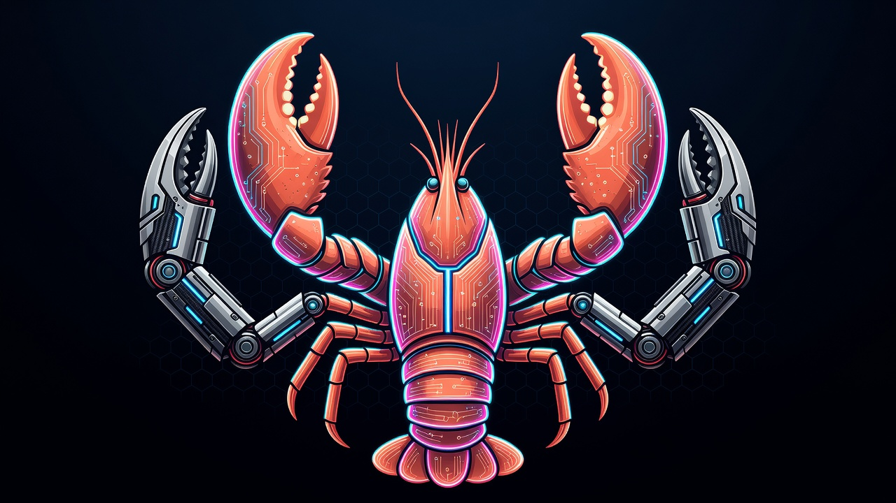

<div align="center">



# 🦞 multi-clawd

**One Claude is never enough.**

Pool every Claude Max account you own into a single failover chain —
same model, next account, full harness on every hop.

[](https://docs.openclaw.ai/plugins)
[](https://www.npmjs.com/package/@drakon-systems/multi-clawd)
[](CHANGELOG.md)
[](LICENSE)
[](tsconfig.json)

*A normal lobster has two claws. This one has four.*

</div>

---

## Quick start

```bash
npm i -g @drakon-systems/multi-clawd   # the CLI (once)

multi-clawd update    # install (or update) the OpenClaw plugin — right flags, restart, doctor
multi-clawd setup     # guided wizard: accounts, isolated second login, pool, watchdog
multi-clawd login claw2   # launch the right Claude sign-in for an account (or re-auth it)
multi-clawd explain   # your whole setup in plain English — accounts, chain, live health
multi-clawd chain     # audit your model routing — what actually serves each turn
multi-clawd doctor    # health check (add --probe for a live end-to-end turn)
```

That's the entire lifecycle. `update` installs the plugin when it's missing and
upgrades it when it's not — nobody types registry flags. `setup` walks you
through the whole shape below and merges config **non-destructively** (backup
first, existing accounts never overwritten, re-runs are no-ops). Prefer not to
install anything? Every command also runs as
`npx @drakon-systems/multi-clawd <command>`.

**The 3-step picture** `setup` walks you through:

1. **Main account** — your existing `claude` login, used as-is (nothing to do).
2. **Second account** — lives in its **own isolated config dir** (a separate
   Claude "app", e.g. `~/.claw2`), so the two logins can never clobber each
   other; token via a secret-manager reference (recommended), token file, or
   the dir's own login.
3. **The pool** — one backend id (`clawd/…`) fronting both: every launch runs
   on the first account that isn't nearly maxed out, and your fallback chain
   routes through it.

Then `multi-clawd explain` shows you exactly what you built.

## Hermes Agent integration

multi-clawd can also import the configured Claude subscriptions into Hermes
Agent's native Anthropic credential pool. Install and set up
[Hermes Agent](https://hermes-agent.nousresearch.com/docs/) first, keep
`hermes` on `PATH`, then preview and apply the import:

```bash
multi-clawd hermes sync --dry-run
multi-clawd hermes sync --strategy round_robin
multi-clawd hermes doctor

# An existing Hermes profile (create it first: hermes profile create work):
multi-clawd hermes sync --profile work --strategy least_used

# Read a non-default OpenClaw configuration:
multi-clawd hermes doctor --config ~/configs/openclaw.json
```

Validated against Hermes Agent **0.20.6**. The bridge/core/CLI integration
tests exercise that installed release's real Python APIs in isolated temporary
homes; on machines without a compatible Hermes install, those integration tests
skip while the no-Hermes CLI safety tests still run.

### Only stable setup tokens are imported

The one credential this adapter will copy is an account's `oauthTokenFile` — a
plain `claude setup-token` value, the same string multi-clawd already passes to
Claude Code as `CLAUDE_CODE_OAUTH_TOKEN`. It carries no refresh token and
nothing rotates it, so a second copy in Hermes stays valid.

Everything else is refused, on purpose:

- **`native` logins are not importable, but need nothing imported.** A native
  login is a `.credentials.json` file holding a *rotating* OAuth grant whose
  refresh token is single-use, so copying it into Hermes and the next refresh —
  by Claude Code, or by Hermes itself — would invalidate the other copy, which
  Hermes then marks dead and drops from rotation. It doesn't need copying
  anyway: Hermes' own `claude_code` credential source already reads that exact
  same native `~/.claude/.credentials.json` directly, so leave a native account
  on that source instead of duplicating the grant.
- **`configDir` logins are not importable, and Hermes cannot be pointed at
  them either.** The same single-use-refresh-token problem applies, and unlike
  a native login there is no Hermes-side fallback: as of Hermes Agent 0.20.6,
  its `claude_code` credential source reads only the native path above, never
  an arbitrary `configDir`. A `configDir` account can only reach Hermes' pool
  by getting its own `oauthTokenFile` (a `claude setup-token`, same as above),
  or it stays OpenClaw-only.
- **`oauthTokenRef` is never resolved.** Reading a gateway secret reference
  here would turn a reference into a copied plaintext secret in a second store;
  the adapter fails closed and says so. An account may carry a `configDir`
  alongside its `oauthTokenFile` — it is simply ignored for Hermes.

`doctor` names every account it cannot import and why; `sync` refuses to write
anything until they are fixed or removed. **Re-run `sync` whenever a
setup-token file changes** — nothing propagates a new token automatically.

### What sync does

Accounts are read from `plugins.entries["multi-clawd"].config.accounts` in
`~/.openclaw/openclaw.json` by default. Every account is validated and every
token file read and parsed before Hermes is asked to write anything.

- Only deterministic rows labelled `multi-clawd:<account-id>` are added or
  updated, and only those rows are sent to Hermes — it merges them into the
  pool under its own lock, so unrelated credentials are never read, copied, or
  rewritten. The operation is idempotent.
- Row priority follows your `pool.accounts` preference order (home account
  first), which is the order Hermes' `fill_first` drains in. Accounts absent
  from `pool.accounts` follow in `accounts[]` order.
- `--strategy` sets Hermes' Anthropic pool strategy to one of `fill_first`,
  `round_robin`, `random`, `least_used`. **Omit it and your configured strategy
  is left alone** (`fill_first` only when nothing is set at all).
- `--dry-run` runs the same validation and planning and writes nothing.
- Planning always reads the target home's *own* pool. A Hermes profile with no
  Anthropic rows yet falls back to reading the global pool — `doctor` labels
  that as an effective-only view, and sync never copies those rows into the
  profile.
- Named profiles must already exist; the adapter never creates one, so a
  deleted profile is not resurrected as an empty skeleton. Run
  `hermes profile create <name>` first. The target home is whatever Hermes
  itself reports as its root (via its own `hermes_constants` module) — never
  reimplemented here — which is `~/.hermes` on POSIX, `%LOCALAPPDATA%\hermes`
  on native Windows, or a Docker/custom `HERMES_HOME` root; a named profile is
  `<root>/profiles/<name>`. `--profile default` always targets that root, even
  when the active `HERMES_HOME` currently points at another profile.
- Only multi-clawd's own broken state (duplicate or malformed managed rows)
  blocks a sync. Several `claude_code` rows, or another tool's malformed row,
  are reported as warnings — they are legitimate states and not this plugin's
  to fix.

The pool and the config are two separate Hermes files. Each write is atomic on
its own and both are verified by re-reading afterwards; the pair is not atomic,
so the pool is written first and both are idempotent — an interruption between
them leaves a state that re-running `sync` repairs, rather than one needing a
rollback.

### What this integration is (and is not)

Hermes talks to the **native Anthropic Messages API** with Hermes' own tool
system. It does not run the OpenClaw plugin backend or the Claude Code harness,
so OpenClaw skills/MCP wiring and Claude Code's built-in harness are not copied
across. multi-clawd supplies the account credentials and the configured Hermes
pool distribution only. Hermes then provides native reactive failover and the
selected distribution strategy. Proactive near-limit telemetry/rotation from
multi-clawd's OpenClaw pool is **not implemented for Hermes yet**.

### Security model

Tokens are read from real files with strict size limits, parsed locally, and
sent to the bundled Python bridge only as one JSON document on **stdin**. They
are never placed in argv, exported as environment variables, or printed to
stdout/stderr — no token, no prefix, no fingerprint — and command errors use
fixed safe messages. On POSIX, a token source file must be private —
group/other-readable or -writable (any `chmod` bits beyond `600`) is refused
outright, not just warned about, checked via `fstat` on the already-open file
descriptor so there is no gap between the check and the read (Windows has no
equivalent bit layout, so the check is a no-op there; the config JSON is read
through the same code path but never needs to be private). The bridge uses
Hermes' installed Python APIs directly (no shell-string execution), writes
only inside the selected `HERMES_HOME`, and never echoes identifiers or other
fields belonging to a row it doesn't manage — an unrelated row is reported by
position only, even when its own source/label/status fields are stuffed with
a token-like string. Paths reject NUL bytes, expand only a leading `~/`, and
profile names cannot contain traversal or separators.

`doctor` validates files, account configuration, and the shape of Hermes' pool
and config on disk — it makes **no live request to Anthropic** and cannot
prove a setup token is still accepted. A token can pass every doctor check and
still be expired or revoked; that is discovered at runtime, where Hermes' own
native 401/429 handling takes over exactly as it does for any other credential
in its pool.

## Why

OpenClaw's bundled `claude-cli` backend runs Claude Code on a **single**
login. When that account hits its usage limit, OpenClaw can't move the
running subprocess onto your second Claude account — it drops down to the
next *model* instead. If you own two Claude Max accounts, the second one's
capacity just sits there, idle, while you get downgraded.

**multi-clawd fixes that.** Each extra account becomes its own first-class
backend that slots into the failover chain like any other model — so a limit
on account #1 rolls to account #2 *on the same model* before any tier drop:

```
claude-cli/claude-fable-5        # main login
  → claw2/claude-fable-5         # 2nd login (this plugin) — same model
    → claw3/claude-fable-5       # 3rd login? go on then
      → anthropic/claude-opus-4-8   # only NOW drop a tier
```

## What you get

- 🦞 **Extra claws** — every account registers as a real CLI backend
  (`claw2/…`, `claw3/…`), resolvable in model refs, fallback chains, and
  per-agent overrides. No API keys, no `baseUrl` hacks.
- 🎱 **The pool (v0.2)** — one backend id (`clawd/…`) fronting all your
  accounts. Every launch runs on the first account that is **not nearly
  maxed out**, using live `rate_limit_event` health (status, utilization,
  reset time) captured from each account's own Claude stream. Hand over
  *before* the limit error; return home automatically when the window
  resets; when the whole pool is exhausted, fail for real so your chain
  drops provider (OpenAI → xAI → …) exactly as configured.
- 📈 **Usage-aware accounts** — a transparent shim tees each account's
  stream-json and records per-window health to
  `~/.openclaw/state/multi-clawd/<account>.json`. Passthrough-first: a state
  write can never break a live turn.
- 🧰 **Full harness on every hop** — each backend is a genuine Claude Code
  subprocess: native tools, skills, MCP bridge, and native compaction all
  stay intact when failover steps across accounts.
- 🔮 **Future-proof models (v0.2)** — model ids are not hardcoded: the
  catalog mirrors the bundled claude-cli list live (with a built-in
  fallback), and *any* modern `claude-*` id resolves on demand. When the
  flagship subscription model changes (Fable 5 → Opus 5), `clawd/claude-opus-5`
  just works — no plugin update.
- 🏠 **Native accounts (v0.2)** — `"native": true` pools the machine's main
  Claude login (default config dir / OS keychain) without duplicating its
  credentials.
- 🔐 **Token hygiene** — setup-tokens are read at launch and passed only via
  the child process env. Never committed, never logged. **v0.3:**
  `oauthTokenRef` resolves tokens through the gateway's own secret providers
  (1Password etc.) — same `{source, provider, id}` shape as the rest of
  openclaw.json, no plaintext files, fixed-reason-code redaction on failure.
- 🧲 **Sticky rotation (v0.3)** — after handing over, the pool dwells on the
  spare account (default 10 min) before returning home, so turns never flap
  across the threshold. Health always overrides stickiness.
- 📟 **Operator alerts (v0.3)** — dead logins (probed every 15 min without
  spending quota), pool rotations, whole-pool exhaustion, and watchdog
  restarts surface through your agent's next heartbeat (e.g. straight into
  Telegram) — not just journal lines.
- 🩺 **`npm run doctor` (v0.3)** — one command that says whether a box is
  actually ready: config/manifest agreement (with the exact `--force`
  preflight strip plan), dist freshness, CLI presence, credential health
  (values never printed), telemetry age, pool + sticky state, watchdog
  presence, optional `--probe` end-to-end turn.
- 🧯 **Self-healing config** — registration re-reads the resolved runtime
  config if the loader hands it an empty block, so a flaky registration pass
  can't silently no-op the plugin.
- 🔎 **Observable registration** — every `register()` pass logs which config
  source won and which backends it registered, so a silent no-op can't hide
  in a long-running gateway.
- 🐶 **Turn-safe eviction watchdog** — `scripts/eviction-watchdog.mjs`
  mitigates upstream openclaw#107408 (idle plugin backends silently dropped)
  by restarting the gateway when the `Unknown CLI backend` signature
  appears. **v0.3:** it defers while any turn is in flight (transcript
  activity across all agents + opt-in worker pidfiles), with a 15-min defer
  cap and 10-min restart cooldown — a restart can no longer eat a live
  reply.

## Platform support

multi-clawd is pure Node (no native modules, no shell-outs) and mirrors the
bundled `claude-cli` backend 1:1 — it runs anywhere OpenClaw's normal Claude
Code backend runs.

| Platform | Status |
|---|---|
| Linux | ✅ Verified in production (x64 and arm64) |
| macOS | ✅ Supported — no platform-specific code paths |
| Windows (WSL2) | ✅ Supported — OpenClaw's recommended gateway runtime on Windows; follow the Linux instructions inside WSL |
| Windows (native) | ⚠️ Expected to work (the gateway spawns `claude` for this plugin exactly as it does for the bundled backend), not yet verified by us — reports welcome |

## Install

**The CLI does it all (recommended)** — see [Quick start](#quick-start):

```bash
npm i -g @drakon-systems/multi-clawd && multi-clawd update
```

`update` runs the registry install with the right flags, offers the gateway
restart, and finishes with a doctor health check.

> ### ⚠️ Keeping up to date: there are two halves
>
> One package installs as **two separate artifacts**, and they update by
> different routes:
>
> | Half | What it is | How it updates |
> |---|---|---|
> | **The plugin** | serves your turns — pooling, rotation, credentials | `multi-clawd update` |
> | **The CLI** | the `multi-clawd` command — `doctor`, `chain`, `setup`, `explain` | `npm i -g @drakon-systems/multi-clawd@latest` |
>
> **`multi-clawd update` upgrades the plugin, not itself.** Since v1.6.0 it
> notices when the command has fallen behind and offers to update it — but
> that notice ships *in the command*, so a CLI older than v1.6.0 has no code
> to warn you with. We found this on three of our own machines, all running
> current plugins behind commands that were three versions stale.
>
> **So run the global install once, by hand, to arm it:**
>
> ```bash
> npm i -g @drakon-systems/multi-clawd@latest
> ```
>
> After that it maintains itself. It matters because `doctor` and `chain` live
> in the CLI — a stale command reports *stale diagnostics about a current
> plugin*, which is a confusing way to be told nothing is wrong. `multi-clawd
> version` shows both halves, and since v1.6.0 says plainly whether the pair
> is a problem.
>
> ### ⚠️ `openclaw plugins update --all` cannot move this plugin
>
> It will tell you the plugin is up to date when it is not. We install with
> `--pin` (OpenClaw's own security audit raises a HIGH finding for unpinned
> install specs, so pinning is the right side of that trade), and OpenClaw
> resolves registry metadata *for the pinned spec* — comparing 1.6.0 against
> 1.6.0 and returning "up to date" while a newer version sits on npm. The
> honest "pinned to X; registry default resolves to Y" message exists in
> OpenClaw but is built inside its `--dry-run` branch, so a real update run
> never prints it.
>
> **Use `multi-clawd update`.** Since v1.7.2 `doctor` also checks the registry
> itself (cached, and silent when offline), so a lagging plugin is reported
> rather than left to a command that reassures you wrongly.

Prefer the raw form?

```bash
openclaw plugins install @drakon-systems/multi-clawd --pin
openclaw gateway restart
```

Either way the gateway pulls the prebuilt package — no clone, no build step,
nothing to keep in sync. `--pin` records the exact resolved version, so an
upgrade is a deliberate act, never a surprise. `openclaw` itself is a *peer*
dependency (the host provides it), so the install stays lean.

**From ClawHub (alternative registry):**

```bash
openclaw plugins install clawhub:@drakon-systems/multi-clawd
```

**From source (contributors, or ahead of a release):**

```bash
git clone https://github.com/Drakon-Systems-Ltd/multi-clawd.git
cd multi-clawd && npm install && npm run build
openclaw plugins install "$(pwd)"
```

```powershell
# Windows (native, PowerShell)
git clone https://github.com/Drakon-Systems-Ltd/multi-clawd.git
cd multi-clawd; npm install; npm run build
openclaw plugins install (Get-Location).Path
```

**Or let your agent install it.** Running an OpenClaw assistant or Claude
Code on the target machine already? Paste it this and go make coffee:

> Read https://raw.githubusercontent.com/Drakon-Systems-Ltd/multi-clawd/v1.8.5/SETUP-AGENT.md
> and follow it to set up multi-clawd on this machine. I own a second
> Claude account — ask me when you need me to log in.

The guide has the guardrails built in (config backup, merge-don't-overwrite,
never print tokens, ask before touching routing).

That URL is pinned to a release tag on purpose: what your agent reads — and
therefore executes — is fixed at a version you chose, not whatever `master`
happens to say today. Swap the tag if you want a different release, but
prefer a tag over a branch.

**Requirements:** OpenClaw ≥ 2026.6, the `claude` CLI on `PATH`, and a
second Claude subscription you own. The current plugin SDK contract and runtime
registration path are tested against OpenClaw **2026.8.1**. The standalone
`multi-clawd` CLI and Hermes commands do not require the optional OpenClaw peer
to be resolvable; plugin loading and OpenClaw-backed commands still require the
host-provided peer.

**Upgrading:**

```bash
npx @drakon-systems/multi-clawd update
```

One command: checks the registry, installs the new version with the right
flags, offers the gateway restart, and finishes with a doctor health check.
(`npm i -g @drakon-systems/multi-clawd` once, and it's just `multi-clawd
update` — with `multi-clawd setup`, `multi-clawd explain` (your setup in
plain English), and `multi-clawd doctor` alongside.)

```bash
# From source:
cd multi-clawd && git pull && npm install && npm run build && npm run doctor
```

On the source path run `npm run build` explicitly — don't rely on the
`prepare` hook to refresh `dist/` on a pull-upgrade (observed stale on a live
production rollout; `doctor` flags it STALE if you forget). If a release adds new
config keys, `openclaw plugins install --force` validates against the *old*
manifest — run `node scripts/doctor.mjs --preflight` first for the strip →
install → re-add plan.

## Set up a second account

**Easiest: the wizard, then the login command.** The wizard walks you through
the whole shape below — main account, isolated second account, token storage,
pool — and merges the result into `openclaw.json` non-destructively (backup
first, merge by id, existing accounts never overwritten, re-runs are no-ops,
never sees a token value). Then `login` performs the actual Claude sign-in
for any account — right flow, right config dir, verified afterwards with the
signed-in email shown:

```bash
multi-clawd setup            # wire the accounts + pool (add --dry-run to preview)
multi-clawd login claw2      # launch the second account's Claude sign-in
multi-clawd login claw1      # (works for re-authing ANY account, any time)
```

`login` knows what each account is: a native account signs in against the
default dir/keychain, an isolated-dir account inside its own dir (created
`0700` if missing), and token accounts get `claude setup-token` — in a
throwaway scratch dir when the account has no dir of its own, so your main
login is never disturbed. You do the OAuth in the launched flow; the CLI
never captures, stores, or prints a token value.
(From a source checkout, `npm run setup` still works for the wizard.)

The key idea either way: your **main** account keeps the default `~/.claude`
login untouched, and each **extra** account gets its *own isolated config
dir* — a separate Claude "app" — so the logins can never clobber each other.

**Or by hand:**

1. Give the account an isolated config dir and capture its Claude Code
   setup-token into it.

   **macOS / Linux / WSL2:**

   ```bash
   mkdir -p ~/.claw2 && chmod 700 ~/.claw2
   CLAUDE_CONFIG_DIR=~/.claw2 claude setup-token > ~/.claw2/oauth-token   # log in as the 2nd account
   chmod 600 ~/.claw2/oauth-token
   ```

   **Windows (native, PowerShell):**

   ```powershell
   New-Item -ItemType Directory -Force "$HOME\.claw2" | Out-Null
   $env:CLAUDE_CONFIG_DIR = "$HOME\.claw2"
   claude setup-token   # log in as the 2nd account
   # store the token as $HOME\.claw2\oauth-token, then lock it to your user:
   icacls "$HOME\.claw2\oauth-token" /inheritance:r /grant:r "$($env:USERNAME):(R,W)"
   ```

2. Configure the plugin (in `openclaw.json`; if `plugins.allow` is set, add
   `"multi-clawd"` to it). `~` expands on every platform; absolute Windows
   paths (`C:\\Users\\you\\.claw2`) work too:

   ```jsonc
   {
     "plugins": {
       "entries": {
         "multi-clawd": {
           "enabled": true,
           "config": {
             "accounts": [
               {
                 "id": "claw2",
                 "label": "Second Max",
                 "configDir": "~/.claw2",
                 "oauthTokenFile": "~/.claw2/oauth-token"
               }
             ]
           }
         }
       }
     },
     "agents": {
       "defaults": {
         // allow the model for agents (separate from the failover chain)
         "models": { "claw2/claude-fable-5": {} }
       }
     }
   }
   ```

3. Slot the backend into your fallback chain:

   ```jsonc
   "agents": { "defaults": { "model": {
     "primary": "anthropic/claude-fable-5",
     "fallbacks": [
       "claw2/claude-fable-5",
       "anthropic/claude-opus-4-8"
     ]
   } } }
   ```

4. Restart the gateway. Done — a limit on the main account now rolls to the
   second account on the same model before any tier drop.

## The pool: proactive rotation (v0.2)

Individual backends (`claw2/…`) fail over *reactively* — OpenClaw steps the
chain when a turn actually dies with a limit error. The pool goes one better:
it watches each account's own usage signal and hands over **before** the
error.

```jsonc
"plugins": { "entries": { "multi-clawd": { "enabled": true, "config": {
  "accounts": [
    { "id": "claw1", "label": "Main Claude", "native": true },
    { "id": "claw2", "label": "Second Max", "configDir": "~/.claw2",
      // v0.3 preferred: resolve via your gateway's secret providers —
      // no plaintext token file on disk
      "oauthTokenRef": { "source": "exec", "provider": "onepassword",
                         "id": "op://YourVault/claw2-setup-token/password" } }
  ],
  "pool": {
    "id": "clawd",
    "accounts": ["claw1", "claw2"],   // preference order; first = home
    "utilizationThreshold": 0.85,     // hand over at 85% of any window
    "minDwellMs": 600000,             // v0.3: anti-flap dwell before returning home
    "degrade": {                      // v0.3.5: last step before provider drop
      "ladder": ["claude-opus-4-8"],  // whole pool exhausted → same account, lower tier
      "pins": [                       // contractual lanes never degrade
        { "agentDirIncludes": "billing-app" }
      ]
    }
  }
} } } },
"agents": { "defaults": {
  "models": { "clawd/claude-fable-5": {} },
  "model": {
    "primary": "clawd/claude-fable-5",        // the pool IS the Claude lane
    "fallbacks": [
      "openai/gpt-5.6",                        // both accounts exhausted
      "xai/grok-4.5"                           // ...or Anthropic is down
    ]
  }
} }
```

How it decides, per launch (all data from each account's live
`rate_limit_event` stream, captured by the shim):

| Account state | Effect |
|---|---|
| `rejected` + reset in the future | skipped until `resetsAt` passes |
| `rejected` with no reset, on a named window | skipped for an hour, then re-probed (v1.7.2) |
| `rejected` on the `unknown` window | still used — that is where a single-model limit lands, and it must not strand the account |
| any window utilization ≥ threshold | skipped (nearly maxed — the point of the pool) |
| `allowed_warning` with a number below threshold | still used — trust the number |
| `allowed_warning` and **no** number, on a short window | skipped (v1.7.2) — see below |
| `allowed_warning` and no number, on the weekly window | still used — weekly warns from ~30% and would flap |
| no data / stale data | used — never rotate on missing evidence |
| whole pool exhausted | home account anyway → real limit error → your chain drops provider |

**Why the short-window rule exists (v1.7.2).** The threshold rule needs a
utilization number, and Anthropic does not send one for the 5-hour session
window — across every observation we hold from two accounts it arrives as a
bare status plus a reset time, while the weekly windows carry percentages. A
rule that waits for a number therefore could never pre-empt the session
limit: the pool would take the hit and rotate afterwards. So on hour-scoped
windows the warning counts on its own. It stays narrow deliberately — a
reported number always wins over the status, and a warning from a window that
has since reset is void, exactly like a stale percentage.

Notes:

- Rotation happens at limit boundaries only. A mid-conversation handover
  costs the Claude CLI its native session (it lives in the previous
  account's config dir); OpenClaw's fresh-session retry recovers the turn.
- Plugin lifecycle hooks were investigated and ruled out for this job: on
  OpenClaw ≤ 2026.7.1, `before_model_resolve` never fires for gateway RPC
  turns and `before_agent_start` overrides are ignored on the prompt path.
  The pool therefore decides inside the backend's own `prepareExecution`,
  which runs on every launch on every turn path. Details in
  [`DESIGN.md`](./DESIGN.md).

## How it works

Three moves, all through the official plugin SDK (details in
[`DESIGN.md`](./DESIGN.md)):

1. **`registerCliBackend`** mirrors the bundled `claude-cli` backend — same
   argv, same JSONL stream parsing, same MCP config-file bridge — scoped to
   one account id.
2. **A minimal provider per account** implements `resolveDynamicModel` +
   `augmentModelCatalog`, which is what makes `claw2/claude-fable-5`
   resolvable without an API key (installed extensions can't use the
   bundled plugins' static-catalog path — this is the supported alternative).
3. **`prepareExecution`** injects that account's own login
   (`CLAUDE_CONFIG_DIR` + `CLAUDE_CODE_OAUTH_TOKEN`) into the child process
   env, after the host's ambient Claude credentials are stripped.

## Legacy issue: idle backend eviction on OpenClaw ≤ 2026.7.1

On OpenClaw ≤ 2026.7.1, core's *scoped* harness activation can silently drop
a plugin-registered CLI backend from the live registry: when an agent turn
selects a harness owned by a different plugin and that scoped set isn't
already fully loaded, core rebuilds the plugin registry with **only** that
plugin (+ the memory plugin) and swaps it in globally. Your `claw2` backend
then fails with `Unknown CLI backend: claw2` — while `openclaw infer model
list` (a separate cache) still lists its models. A common real-world trigger
is an hourly heartbeat running on a model served by another harness.

- Upstream bug: [openclaw#107408](https://github.com/openclaw/openclaw/issues/107408)
- Upstream fix: [openclaw#108110](https://github.com/openclaw/openclaw/pull/108110)

OpenClaw 2026.8.1 includes the fix. On affected older runtimes, a gateway
restart always restores the backend (startup
loads are full-scope), and backends that are in regular use effectively
re-assert themselves. This repo ships a ready-made mitigation —
`scripts/eviction-watchdog.mjs` — which tails the gateway log for the
`Unknown CLI backend` signature and restarts the gateway at most once per
eviction event. Run it every few minutes from cron/launchd/systemd:

```bash
node scripts/eviction-watchdog.mjs                    # restart on detection
MULTI_CLAWD_WATCHDOG_DRY=1 node scripts/eviction-watchdog.mjs   # report only
```

An in-process fix was investigated and is impossible by design:
`registerCliBackend` is not late-callable, there is no registry-rebuilt
event, and no plugin API can force a rebuild. See `DESIGN.md`.

## Known limitations

- **Shim window persistence is sequential-safe, not concurrent-writer-safe.**
  `persistState()` in `src/shim.ts` does a read-merge-write on every save so a
  turn that only reports one window type (say `five_hour`) doesn't clobber
  the last-seen `seven_day` data — but the read, merge, and rename aren't
  atomic together. Two truly concurrent shim processes for the *same*
  account can still race each other and drop an event on last-rename-wins.
  In practice this needs two in-flight turns on one account at once, which
  is rare, but it's a real gap. A per-account lock/retry protocol is tracked
  as a v0.3.x follow-up.

## Security

See **[SECURITY.md](SECURITY.md)** for how to report a vulnerability, exactly
how credentials are handled, and a table documenting every process-spawn
callsite (the ones static scanners flag) and why each exists.

**Full declaration of what this plugin touches — nothing else:**

| Surface | What multi-clawd does |
|---|---|
| Network | **Zero egress of its own.** The only network activity is npm/registry traffic during `install`/`update`, and the Claude Code subprocesses talking to Anthropic exactly as the bundled backend does. No telemetry, no analytics, no vendor endpoints. |
| Credentials | Reads each account's setup-token at launch (file, or a secret-manager reference resolved by your gateway) and passes it **only** via the child process env. Never written elsewhere, never logged, never printed — log redaction is covered by dedicated tests. |
| Files read | `~/.openclaw/openclaw.json` (config), account config dirs you declare (e.g. `~/.claw2`), token files you declare. |
| Files written | `~/.openclaw/state/multi-clawd/<account>.json` (local usage-health telemetry, stays on the box), config backups the wizard takes before merging, and — only if you accept the wizard's watchdog step — one systemd user unit / launchd plist pointing at the installed watchdog script. |
| Processes | Spawns the `claude` CLI per turn (same as the bundled backend). The optional watchdog may restart the OpenClaw gateway when the eviction signature appears — that's its entire job, documented below. |
| Consent | The wizard asks before every write, merges non-destructively, and never overwrites an existing account entry. `--dry-run` previews everything. |

Housekeeping:

- Tokens are never committed and never logged; `.gitignore` blocks token
  and account directories by default.
- Prefer a secret reference (`oauthTokenRef`, v0.3) over a plaintext
  file; when a file is used, keep it `0600` (POSIX) or locked to your user
  with `icacls` (Windows).
- **Credential resolution fails closed (v1.7.3).** An account that declares
  `oauthTokenRef` or `oauthTokenFile` is authenticated by that token. If it
  resolves to nothing — provider briefly unavailable, empty secret, truncated
  file — and the account has no `configDir` to fall back on, the launch is
  refused with `declares a token source but none resolved` rather than
  allowed to proceed on the machine's default login and spend a different
  account's quota under this account's name. Native accounts are exempt: the
  default login *is* their credential.
- Migrating a token file into a vault? `op read` (and most secret CLIs)
  append a trailing newline on output — resolution trims the resolved
  value (guaranteed in `token-resolution.ts`), so a file-vs-vault diff
  showing only a trailing-newline mismatch is a false alarm.
- Use only accounts you own, within your provider's terms of service.

## Status & roadmap

Early but real — built for and dogfooded in production.

- **v0.1** — single extra account, verified end-to-end ✅
- **v0.1.1** — `jsonlDialect` declared on registered backends, fixing raw
  stream-JSON reaching connected channels on live turns ✅
- **v0.1.2** — registration-pass logging (config-source attribution +
  registered-backend summary) ✅
- **v0.2** — the pool: proactive near-limit rotation from live
  `rate_limit_event` health; native (keychain) accounts; future-proof model
  resolution (mirrored catalog + permissive `claude-*` pass-through);
  eviction watchdog; vitest suite ✅
- **v0.3** — hardening from field feedback: `oauthTokenRef` via gateway
  secret providers with strict redaction; sticky rotation with anti-flap
  dwell; login-health probes + heartbeat operator alerts; turn-safe
  watchdog (lane-guard); `doctor` + `--preflight`; build-on-install; shim
  window persistence ✅
- **v0.3.5** — tier-aware degradation (whole pool exhausted → step down the
  configured ladder on the same account, e.g. Fable → Opus, instead of
  dropping provider) + never-degrade pins for contractual model lanes +
  single-account pools ✅
- **v0.3.6** — reactive model-limit capture: a 429 "reached your <model>
  limit" error is recorded as a model-scoped rejected window, and health is
  model-aware (exhausted-for-Fable ≠ exhausted-for-Opus) — the first hard
  limit teaches the pool, the next launch flips accounts ✅
- **v0.3.7** — reset-aware per-window staleness: reset-bearing windows
  (weekly, model:*) bind until their reset regardless of observation age
  (capped at 8d with a clock-skew alarm), reset-less windows keep TTL/decay,
  and model windows age by their own TTL independent of pool `staleAfterMs`
  — closes the quiet-pool blindness half of the no-flip failure class ✅
- **v1.0** — the public line: published to npm as
  [`@drakon-systems/multi-clawd`](https://www.npmjs.com/package/@drakon-systems/multi-clawd),
  `openclaw` demoted to an optional peer, registry installs verified
  end-to-end ✅
- **v1.1–v1.2** — the `multi-clawd` CLI (`update` / `setup` / `doctor`);
  wizard owns the eviction watchdog (schedules it, detects + repoints
  orphaned units after migrations); wizard account-protection (existing
  accounts default to keep-unchanged; suspicious secret refs challenged) ✅
- **v1.3** — `multi-clawd explain`: the whole setup in plain English —
  accounts, pool decisions, every fallback rung annotated, live health with
  reset times ✅
- **v1.4** — `multi-clawd login <account>`: the right Claude sign-in flow
  for each account shape, verified afterwards (signed-in email shown, token
  values never touched); ClawHub package published under
  `@drakon-systems` ✅
- **Next** — standalone localhost proxy (OpenAI-compatible) so Hermes and
  custom runtimes can share the pool; true per-session affinity; local
  five-hour-window signal (turn counting); per-account lock for the shim
  persistence race

See [`DESIGN.md`](./DESIGN.md) for the architecture, the three obvious
approaches that *don't* work, and why.

---

<div align="center">

Built by [Drakon Systems Ltd](https://drakonsystems.com) · MIT licensed

🦞 *Claws out.*

</div>
